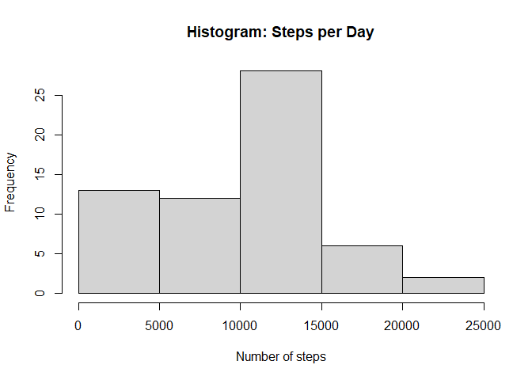
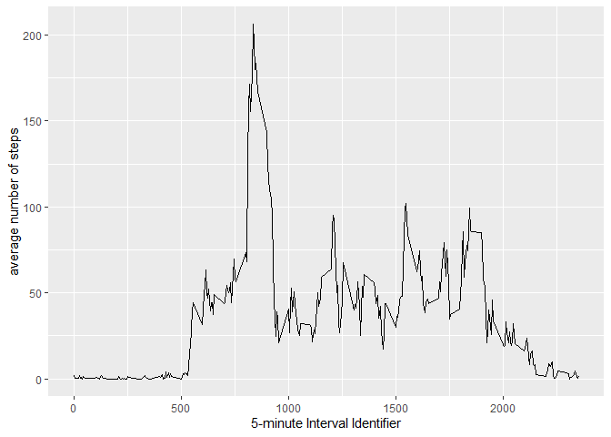
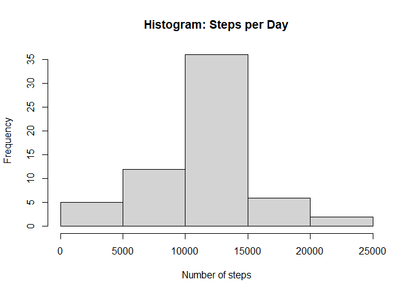
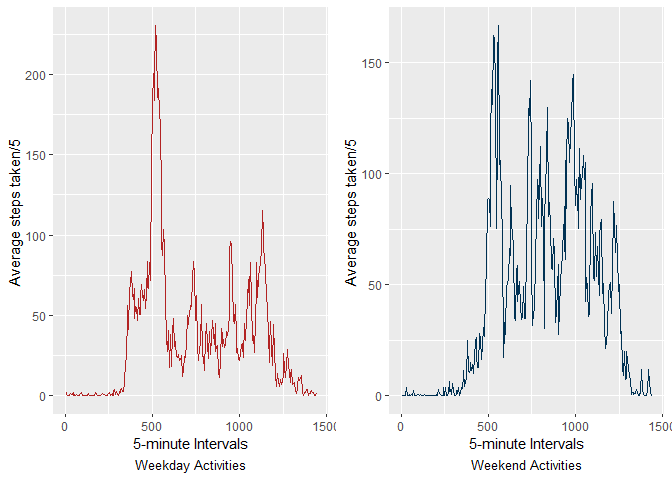

## 1 - Introduction  
  
It is now possible to collect a large amount of data about personal movement using activity monitoring devices or even the sensors embedded in a smartphone. But these data remain under-utilized both because the raw data are hard to obtain and there is a lack of statistical methods and software for processing and interpreting the data.  

This project makes use of data from a personal activity monitoring device which collects data at 5 minute intervals through out the day. The data set of interest for this analysis consists of two months of data from an anonymous individual collected during the months of October and November, 2012 and includes the number of steps taken in 5 minute intervals each day.


## 2 - Loading and preprocessing the data  

### 2.1 - System Setup  
  
  - a personal computer running Microsoft® Windows® 10 OS 
  - a high speed Internet connection
  - RStudio Version 1.3.1093  
  
###### *Any product names used in this document are for identification purposes only and might be trademarks of their respective companies.  Any and all rights to those marks are hereby disclaimed.*    
  
### 2.2 - Load the data   
The data for this project was downloaded from the link [Activity monitoring data][1] provided on the course website. The download, performed on Mon Apr 19, 2021, yielded a zip folder **repdata_data_activity.zip** which was placed in a working directory **wrkdir** from within which all computations related to the research activities for this project were conducted. If the file **activity.csv**  exists in the working directory read it otherwise unzip **repdata_data_activity.zip** to place  **activity.csv**   into the working directory from the zip archive.


```r
abb <- getwd()

if(!file.exists("activity.csv")){	   
  unzip(zipfile="repdata_data_activity.zip")}
```

### 2.3a - Process the data (if necessary) into a format suitable for the analysis 
We proceed to obtain the dataset **datap**  by reading the  **activity.csv** 
Process/transform the data (if necessary) into a format suitable for the analysis
For this analysis, package readr provides the read_csv function that enables
reading the data into the dataset in a format suitable for the analysis without 
the need to post-process or transform the datset. In particular, the date variable is read as a Date object. 


```r
datap <- read_csv("activity.csv", na="NA", col_names = TRUE,
                  col_types = cols(steps = col_integer(),
                  date = col_date(format = "%Y-%m-%d"),
                  interval = col_integer()),
                  locale = default_locale())
```
At this point we have obtained the dataset **datap** for the exploratory analysis that follows. Lets examine **datap** through some summary statistics.


```r
str(datap)
```

```
## spec_tbl_df [17,568 x 3] (S3: spec_tbl_df/tbl_df/tbl/data.frame)
##  $ steps   : int [1:17568] NA NA NA NA NA NA NA NA NA NA ...
##  $ date    : Date[1:17568], format: "2012-10-01" "2012-10-01" ...
##  $ interval: int [1:17568] 0 5 10 15 20 25 30 35 40 45 ...
##  - attr(*, "spec")=
##   .. cols(
##   ..   steps = col_integer(),
##   ..   date = col_date(format = "%Y-%m-%d"),
##   ..   interval = col_integer()
##   .. )
```

```r
summary(datap)
```

```
##      steps                     date               interval      
##  Min.   :  0.0000000000   Min.   :2012-10-01   Min.   :   0.00  
##  1st Qu.:  0.0000000000   1st Qu.:2012-10-16   1st Qu.: 588.75  
##  Median :  0.0000000000   Median :2012-10-31   Median :1177.50  
##  Mean   : 37.3825995807   Mean   :2012-10-31   Mean   :1177.50  
##  3rd Qu.: 12.0000000000   3rd Qu.:2012-11-15   3rd Qu.:1766.25  
##  Max.   :806.0000000000   Max.   :2012-11-30   Max.   :2355.00  
##  NA's   :2304
```

### 3.1 - The mean total number of steps taken per day
For this part of the analysis we ignore any missing values in **datap** 

#### 3.1.1 - Calculate the total number of steps taken per day

```r
totalNsteps <- datap %>%
    group_by(date) %>%
    summarise(stepsEachDay = sum(steps, na.rm = TRUE)) 
```

#### 3.1.2 - Histogram of the total number of steps taken each day
The histogram will help us visualize the total number of steps taken each day

```r
hist(totalNsteps$stepsEachDay, xlab= "Number of steps", main="Histogram: Steps per Day")
```

<!-- -->

#### 3.1.3 - The mean and median of the total number of steps taken each day

```r
mean_median <- summarise(totalNsteps, 
                         Mean   = mean(stepsEachDay, na.rm = TRUE), 
                         Median = median(stepsEachDay, na.rm = TRUE))
```
'
The mean and median of the total number of steps taken each day are 

Mean      = 9354  steps and;      
Median    = 10395  steps 

## 4 - The average daily activity pattern

### 4.1.	Make a time series plot (type = "l") of the 5-minute interval (x-axis)   
and the average number of steps taken, averaged across all days (y-axis)


```r
steps_by_interval <- datap %>%
                     group_by(interval) %>%
                     summarise(average_steps = mean(steps, na.rm = TRUE))

g <- ggplot(data = steps_by_interval, aes(x = interval, y = average_steps)) +
      geom_line() +
      xlab("5-minute Interval Identifier") + 
      ylab("average number of steps") 

plot(g)
```

<!-- -->

```r
#dev.copy(png, "Plot2.png")
#rm(gg)
#dev.off()
```

### 4.2 The 5-minute interval, on average across all the days in the dataset, that contains the maximum number of steps.


```r
Maxsteps_in5min <- steps_by_interval[steps_by_interval$average_steps == 
                    max(steps_by_interval$average_steps), ]
```

The five minute interval on average across all the days in the dataset that contains the maximum number of steps is 835

## 5 - Imputing Missing Values   

There are a number of days/intervals where there are missing values (coded as NA).    The presence of missing days may introduce bias into some calculations or summaries of the data.

### 5.1.	Calculate and report the total number of missing values in the dataset  
(i.e. the total number of rows with NAs


```r
totalmissing <-  sum(is.na(datap$steps))
```
Total number of rows with missing values (i.e. NAs) is  **2304**   

The total number of NAs in each column of the dataset ***datap***


```r
nmissing_colwise <- colSums(is.na(datap))
head(nmissing_colwise)
```

```
##    steps     date interval 
##     2304        0        0
```

The missing values are only present in the column for "steps"

### 5.2 Strategy for filling in all of the missing values in the dataset.   
 The strategy for filling in all of the missing values is to estimate the missing values using the non-missing values of steps. There are two ways this can be acheived. 
 
 First use the non-missing values of steps to calculate the mean and the median of steps for each interval in the dataset (recall that the intervals are periodic in that they repeat for each day). Each step which has a mssing value is assigned the mean (or the median)that corresponds to the interval that the particular step with missing value is associated.    
 In a similar manner, the non-missing value of steps are used to compute the mean and the median for each day. Each missing value of steps in a day is assigned the mean (or the median) value for that day.
 
#### 5.3.1  Creating secondary dependent fields for ease of use   
The independent fields or variables are steps and date. Each date corresponds to a 24 hour day in a specific month of a #specifis year. Each 24 hour day has 24 hours each of which is segmented into 60 minutes. In this dataset, each 60 minute hour is segmented into 5 minute intervals - the interval field. There are 288 intervals for each hour. Groups of 288 intervals representing a #hour in a day are not contiguous (example the second set of 288 intervals is tagged 1000 thrus 1288 and so forth. This maybe convenient for use on a device that transduces and stores the steps and the date but the data-structure does not reflect normal, everyday time keeping. We will derive secondary or dependent fields /variables from the primary fields to help us perform exploratory 
analysis in an intuitive fashion using the time-keeping structures of everyday life.


```r
datap <- datap %>% mutate(min_day  = as.integer(as.integer(datap$interval+5)- 
                                                  as.integer(datap$interval/100)*40)) 

datap <- datap %>% mutate (hr_day  = as.integer(ifelse((datap$min_day%% 60) == 0, 
                                                       datap$min_day%/%60,                                                                     (datap$min_day%/%60) +1)),
                           day_week = as.integer(strftime(datap$date, format = "%u")),                           
                           miss_val   =ifelse(is.na(steps), TRUE, FALSE))
```

In the above r code-chunk, **min_day** is a five minute interval in a 24 hour day. There are 288 such intervals in each 24 hour day referenced sequentially from 1 thru 288. The cycle repeats for the next 24 hour day. 

Next, **hr_day** is the hour in a 24 hour day numbered sequentially from 1 thru 24. Each hr_day has 288 min_day. Likewise, **day_week** is the day of the week beginning Mon as day 1 and Sun as day 7. The logical variable **miss_val** is TRUE if the steps is a missing value (NA) and FALSE if steps hav a value >= 0. 

In the code-chunk that follows, the abbreviated name of the weekday **wkdname** and a field **wkdayid** that takes the value **weekDay** if **wkdname** is one of Mon, Tue, Wed, Thu, or Fri or the value **weekEnd** if **wkdname** is Sat or Sun. 


```r
datap <- datap %>% mutate (wkdname  = (strftime(datap$date, format = "%a")),
                           rnum = row_number())
datap <- datap %>% group_by(wkdname) %>% 
  mutate (wkdayid = as.character(ifelse((wkdname== "Sat" | wkdname == "Sun"), 
                                        'WeekEnd', 'WeekDay')))

str(datap)
```

```
## grouped_df [17,568 x 10] (S3: grouped_df/tbl_df/tbl/data.frame)
##  $ steps   : int [1:17568] NA NA NA NA NA NA NA NA NA NA ...
##  $ date    : Date[1:17568], format: "2012-10-01" "2012-10-01" ...
##  $ interval: int [1:17568] 0 5 10 15 20 25 30 35 40 45 ...
##  $ min_day : int [1:17568] 5 10 15 20 25 30 35 40 45 50 ...
##  $ hr_day  : int [1:17568] 1 1 1 1 1 1 1 1 1 1 ...
##  $ day_week: int [1:17568] 1 1 1 1 1 1 1 1 1 1 ...
##  $ miss_val: logi [1:17568] TRUE TRUE TRUE TRUE TRUE TRUE ...
##  $ wkdname : chr [1:17568] "Mon" "Mon" "Mon" "Mon" ...
##  $ rnum    : int [1:17568] 1 2 3 4 5 6 7 8 9 10 ...
##  $ wkdayid : chr [1:17568] "WeekDay" "WeekDay" "WeekDay" "WeekDay" ...
##  - attr(*, "groups")= tibble [7 x 2] (S3: tbl_df/tbl/data.frame)
##   ..$ wkdname: chr [1:7] "Fri" "Mon" "Sat" "Sun" ...
##   ..$ .rows  : list<int> [1:7] 
##   .. ..$ : int [1:2592] 1153 1154 1155 1156 1157 1158 1159 1160 1161 1162 ...
##   .. ..$ : int [1:2592] 1 2 3 4 5 6 7 8 9 10 ...
##   .. ..$ : int [1:2304] 1441 1442 1443 1444 1445 1446 1447 1448 1449 1450 ...
##   .. ..$ : int [1:2304] 1729 1730 1731 1732 1733 1734 1735 1736 1737 1738 ...
##   .. ..$ : int [1:2592] 865 866 867 868 869 870 871 872 873 874 ...
##   .. ..$ : int [1:2592] 289 290 291 292 293 294 295 296 297 298 ...
##   .. ..$ : int [1:2592] 577 578 579 580 581 582 583 584 585 586 ...
##   .. ..@ ptype: int(0) 
##   ..- attr(*, ".drop")= logi TRUE
```

```r
summary(datap)
```

```
##      steps                     date               interval      
##  Min.   :  0.0000000000   Min.   :2012-10-01   Min.   :   0.00  
##  1st Qu.:  0.0000000000   1st Qu.:2012-10-16   1st Qu.: 588.75  
##  Median :  0.0000000000   Median :2012-10-31   Median :1177.50  
##  Mean   : 37.3825995807   Mean   :2012-10-31   Mean   :1177.50  
##  3rd Qu.: 12.0000000000   3rd Qu.:2012-11-15   3rd Qu.:1766.25  
##  Max.   :806.0000000000   Max.   :2012-11-30   Max.   :2355.00  
##  NA's   :2304                                                   
##     min_day            hr_day         day_week              miss_val      
##  Min.   :   5.00   Min.   : 1.00   Min.   :1.00000000000   Mode :logical  
##  1st Qu.: 363.75   1st Qu.: 6.75   1st Qu.:2.00000000000   FALSE:15264    
##  Median : 722.50   Median :12.50   Median :4.00000000000   TRUE :2304     
##  Mean   : 722.50   Mean   :12.50   Mean   :3.91803278689                  
##  3rd Qu.:1081.25   3rd Qu.:18.25   3rd Qu.:6.00000000000                  
##  Max.   :1440.00   Max.   :24.00   Max.   :7.00000000000                  
##                                                                           
##    wkdname               rnum            wkdayid         
##  Length:17568       Min.   :    1.00   Length:17568      
##  Class :character   1st Qu.: 4392.75   Class :character  
##  Mode  :character   Median : 8784.50   Mode  :character  
##                     Mean   : 8784.50                     
##                     3rd Qu.:13176.25                     
##                     Max.   :17568.00                     
## 
```


For the purposes of this assignment, the analysis is performed on each 5 minute interval and each **steps** which is NA (missing value) is assigned the average value of the 5-minute interval it is associated with.


```r
datap <- datap %>% group_by(min_day) %>% mutate(
  mean_stpm =  mean(steps,na.rm=TRUE),
  median_stpm = median(steps, na.rm=TRUE)) %>%
  ungroup()

names(datap)
```

```
##  [1] "steps"       "date"        "interval"    "min_day"     "hr_day"     
##  [6] "day_week"    "miss_val"    "wkdname"     "rnum"        "wkdayid"    
## [11] "mean_stpm"   "median_stpm"
```

### 5.4 A new dataset equal to the original dataset (**datap**) with the missing data filled in


```r
satap <- datap %>% transmute(steps = ifelse(miss_val, mean_stpm, steps))  %>% 
  ungroup()

datap$steps <- satap$steps
rm(satap)
```

#### 5.5.1 - Calculate the total number of steps taken per day

```r
totalNstepsf <- datap %>%
  group_by(date) %>%
  summarise(stepsEachDayf = sum(steps, na.rm = TRUE)) 
```

#### 5.5.2 - Histogram of the total number of steps taken each day
The histogram will help us visualize the total number of steps taken each day

```r
hist(totalNstepsf$stepsEachDayf, xlab= "Number of steps", main="Histogram: Steps per Day")
```

<!-- -->

#### 5.5.3 - The mean and median of the total number of steps taken each day

```r
mean_median2 <- totalNstepsf %>% summarise(
  Mean_imp   = mean(stepsEachDayf, na.rm = TRUE), 
  Median_imp = median(stepsEachDayf, na.rm = TRUE)) 
```
'
The mean and median of the total number of steps taken each day are 

Mean_imp      = 10766.1886792453  steps and;      
Median_imp    = 10766.1886792453  steps 

#### 5.5.4 - Do these values of mean and median differ from the estimates from the first part of the assignment. 

Mean_difference =     1411.95917104856   steps and;     
Median_difference =   371.188679245282   steps   


## 6 - Are there differences in activity patterns between weekdays and weekends?


```r
sc <- datap %>% group_by(wkdayid,min_day) %>% 
  summarize(wkavgsteps = mean(steps, na.rm=TRUE))
```

```
## `summarise()` has grouped output by 'wkdayid'. You can override using the `.groups` argument.
```

```r
grpwkday <- sc[sc$wkdayid== "WeekDay", ]
grpwkend <- sc[sc$wkdayid== "WeekEnd", ]

wdx <- ggplot(grpwkday, aes(x=min_day, y=wkavgsteps)) +
  geom_line(color="firebrick") +
  labs(x = "5-minute Intervals") +
  labs(y = "Average steps taken/5 ") +
  labs(caption = "Weekday Activities") +
  theme(plot.caption = element_text(hjust = 0.5, size=10)) 

wex <- ggplot(grpwkend, aes(x=min_day, y=wkavgsteps)) +
  geom_line(color= "#003153") +
  labs(x = "5-minute Intervals") +
  labs(y = "Average steps taken/5 ") +
  labs(caption = "Weekend Activities") +
  theme(plot.caption = element_text(hjust = 0.5, size=10))

grid.arrange(wdx,wex, nrow=1)   #need library gridExtra
```

<!-- -->


[1]: "https://d396qusza40orc.cloudfront.net/repdata%2Fdata%2Factivity.zip"
[2]: "https://bjsm.bmj.com/content/52/12/776"

